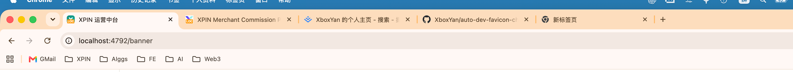
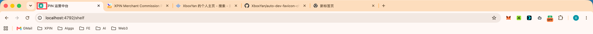

# Local Favicon Labeler

> 为 `localhost`、开发、测试等环境的原始 favicon 叠加清晰标签，避免多标签页时认错环境。

## 它解决什么问题？

同一个项目通常会同时存在本地、开发、测试与正式环境。它们的 favicon 往往完全一致，多开标签页时很容易误操作。

Local Favicon Labeler 会保留网站原来的图标，并在右下角合成一枚可读的环境标签。例如访问 `localhost:4792` 时，标签页仍显示项目本身的图标，同时叠加橙色 **LOC**。

## 效果

下面仅展示浏览器顶部区域：标签左侧保留各项目原始 favicon，同时叠加橙色 `LOC` 标记；切换路由后仍可一眼识别本地环境。

| 访问 `/banner` | 切换到 `/shelf` |
| --- | --- |
|  |  |

## 下载与安装

### 方式一：下载安装包（推荐）

1. 前往 [Releases](https://github.com/52css/localhost-favicon-labeler/releases/latest)，下载最新版本的 `localhost-favicon-labeler-v*.zip`。
2. 解压 ZIP 文件。
3. 打开 `chrome://extensions`；Edge 请打开 `edge://extensions`。
4. 开启右上角的「开发者模式」。
5. 点击「加载已解压的扩展程序」，选择解压后的 `localhost-favicon-labeler` 文件夹。

### 方式二：从源码安装

1. 下载或克隆本仓库源码。
2. 在 `chrome://extensions` / `edge://extensions` 开启「开发者模式」。
3. 点击「加载已解压的扩展程序」，选择本仓库根目录。

安装后，默认规则会匹配 `localhost`、`127.0.0.1` 与 `[::1]`，显示橙色 `LOC`。

## 配置规则

点击浏览器工具栏中的扩展图标即可打开配置页面；也可以右键图标选择「选项」，或在扩展详情页点击「扩展程序选项」。

配置修改会即时写入浏览器同步存储：保存后，当前已打开的匹配标签页会自动更新标记。

每条规则都包含：

| 字段 | 说明 |
| --- | --- |
| 颜色 | 标签底色，用于快速区分环境 |
| 名称 | 标签文字，建议使用 2 个中文字符或 3 个英文字符，例如 `LOC`、`DEV`、`TEST` |
| 匹配 | 域名匹配条件，只匹配 hostname，不匹配端口与路径 |

匹配示例：

| 想匹配的网站 | 配置示例 |
| --- | --- |
| 本地项目 | `localhost, 127.0.0.1, [::1]` |
| 所有 dev 子域名 | `dev*` |
| 测试环境 | `test.example.com, staging.example.com` |

- 规则按从上到下的顺序命中，第一条匹配规则生效。
- `*` 表示任意字符，例如 `dev*` 可以匹配 `dev.example.com`。
- 多个匹配项可用英文逗号或换行分隔。
- 保存后，已经打开的匹配标签页会自动重新标记；若网站自行频繁修改 favicon，刷新页面即可。

## 工作方式

扩展会读取页面当前正在使用的 favicon，再在后台将它与标签合成为一个 SVG，最终替换**同一个** favicon 链接。这样既保留项目图标，也不会把端口、项目名称或某个框架写死。

针对 Next.js 这类单页应用，扩展也会监听路由切换与 favicon 更新，确保从菜单跳转后标签仍然存在。

## 开发

这是一个无构建步骤的 Manifest V3 扩展：修改源码后，在扩展管理页点击「重新加载」，然后刷新目标网页即可验证。

## 贡献与许可

欢迎通过 [Issues](https://github.com/52css/localhost-favicon-labeler/issues) 提交问题与建议。

本项目采用 [MIT License](LICENSE) 开源。
